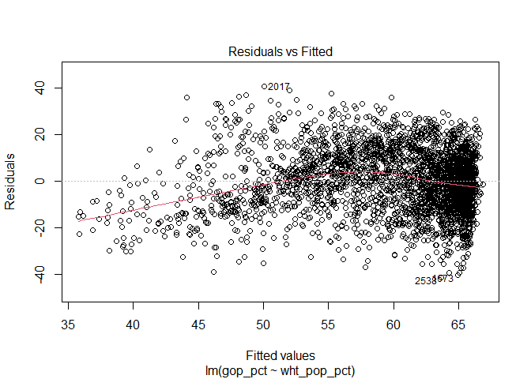

Geog6300: Lab 7
================

## R Markdown

## Regression

**Value:** 30 points

``` r
library(sf)
library(tidyverse)
library(ggpubr)
library(tmap)
library(Hmisc)
#install.packages("lmtest")
library(stargazer)
library(lmtest)
#install.packages("car")
library(car)
#library(raster)
```

**Overview:** This lab focuses on regression techniques. You’ll be
analyzing the association of county demographics on the presidential
vote in 2012 (the Obama-Romney election).

\#\#\#Part 1: Importing data and descriptive statistics\#\#\# This lab
uses the same county data file you used in Lab 6. You also have a county
shapefile that we’ll use for mapping these results.

**Question 1 (2 points)** *Load the two files listed above–the election
data and county level shapefile. Filter the election data for just the
2012 election, then join it to the county shapefile.*

``` r
election_data = read.csv("data/elections0816_demog_pct.csv") %>%
  filter(year == "2012")
counties_shp = st_read("data/US_counties_albersusa.shp")
```

    ## Reading layer `US_counties_albersusa' from data source `C:\Users\samsh\OneDrive\Documents\Productivity\College\GEOG4300 Data Science in GIS\Lab 7\geog4-6300-lab-7-SamShuster97\data\US_counties_albersusa.shp' using driver `ESRI Shapefile'
    ## Simple feature collection with 3143 features and 1 field
    ## geometry type:  MULTIPOLYGON
    ## dimension:      XY
    ## bbox:           xmin: -2100000 ymin: -2500000 xmax: 2516374 ymax: 732103.3
    ## CRS:            unknown

``` r
election_sf = counties_shp %>%
  inner_join(election_data)
```

    ## Joining, by = "gisjn_cty"

For this analysis, you’ll be looking at the following variables:

*gop\_pct: The % of vote for Romney (the Republican) in 2012 *medinc:
Median household income *wht\_pop\_pct: % of population classified as
white *ed\_graddeg\_pct: % of the population whose highest educational
attainment is a graduate degree.

You’ll be evaluating how each of the last three variables was associated
with the county’s Republican vote in 2012. To start with, you should
assess the distribution of each variable

**Question 2 (3 points + XC)** *Create a qqplot for each of the four
variables of interest. For 1 point extra credit, use the stat\_qq and
stat\_qq\_line functions in ggplot to do so. See the documentation for
details. Based on these graphs, assess the normality of these
variables.*

``` r
ggqqplot(election_data$gop_pct, title = "GOP Percentage", color = "red4", xlab = "Theoretical", ylab = "Sample")
```

<!-- -->

``` r
hist(election_data$gop_pct)
```

<!-- -->

``` r
ggqqplot(election_data$medinc, title = "Median Household Income", color = "darkgreen", xlab = "Theoretical", ylab = "Sample")
```

<!-- -->

``` r
hist(election_data$medinc)
```

<!-- -->

``` r
ggqqplot(election_data$wht_pop_pct, title = "Percentage of Population Classified as White", color = "lightsalmon3", xlab = "Theoretical", ylab = "Sample")
```

<!-- -->

``` r
hist(election_data$wht_pop_pct)
```

<!-- -->

``` r
ggqqplot(election_data$ed_graddeg_pct, title = "Percentage of Population with Graduate Degrees", color = "purple4", xlab = "Theoretical", ylab = "Sample")
```

<!-- -->

``` r
hist(election_data$ed_graddeg_pct)
```

<!-- -->

``` r
#df <- data.frame(y = rt(200, df = 5))
#p <- ggplot(df, aes(sample = y))
#p + stat_qq() + stat_qq_line()
ggplot(election_data, aes(sample = election_data$gop_pct)) + stat_qq(color="firebrick2", alpha=1) + geom_abline(intercept = mean(election_data$gop_pct), slope = sd(election_data$gop_pct))
```

    ## Warning: Use of `election_data$gop_pct` is discouraged. Use `gop_pct` instead.

<!-- -->

``` r
ggplot(election_data, aes(sample = election_data$medinc)) + stat_qq(color="darkgreen", alpha=1) + geom_abline(intercept = mean(election_data$medinc), slope = sd(election_data$medinc))
```

    ## Warning: Use of `election_data$medinc` is discouraged. Use `medinc` instead.

<!-- -->

``` r
ggplot(election_data, aes(sample = election_data$wht_pop_pct)) + stat_qq(color="lightsalmon3", alpha=1) + geom_abline(intercept = mean(election_data$wht_pop_pct), slope = sd(election_data$wht_pop_pct))
```

    ## Warning: Use of `election_data$wht_pop_pct` is discouraged. Use `wht_pop_pct`
    ## instead.

<!-- -->

``` r
ggplot(election_data, aes(sample = election_data$ed_graddeg_pct)) + stat_qq(color="purple4", alpha=1) + geom_abline(intercept = mean(election_data$ed_graddeg_pct), slope = sd(election_data$ed_graddeg_pct))
```

    ## Warning: Use of `election_data$ed_graddeg_pct` is discouraged. Use
    ## `ed_graddeg_pct` instead.

<!-- -->

There is a slight negative skew to the percentage of the GOP. The
Household income variable has a strong positive skew. The variable
pertaining to the percentage of white population has a strong negative
skew and the Grad degrees strong positive skew.

**Question 3 (2 points)** *Use tmap to map the four variables of
interest using Jenks natural breaks as the classification method.*

``` r
tmap_mode("plot")
```

    ## tmap mode set to plotting

``` r
#fisher classification method used in place of jenks per the recommendation of R
tm_shape(election_sf)+tm_polygons("gop_pct", style = "fisher")
```

<!-- -->

``` r
#tm_shape(election_sf)+tm_polygons("gop_pct", style = "jenks")
tm_shape(election_sf)+tm_polygons("medinc", style = "fisher")
```

<!-- -->

``` r
tm_shape(election_sf)+tm_polygons("wht_pop_pct", style = "fisher")
```

<!-- -->

``` r
tm_shape(election_sf)+tm_polygons("ed_graddeg_pct", style = "fisher")
```

<!-- -->

**Question 4 (3 points)** *Based on the map from question 3, summarise
two major patterns you see in the spatial distribution of these data. Be
sure to make specific references to your data to illustrate your
points.*

Those in the midwest and mountainous regions of the country tend to vote
conservatively. There is a high percentage of conservative voters in the
Southern region as well, especially around Northern Alabama and Georgia
leading up into Tennessee and Kentucky. The regions with the highest
population percentage of those classified as white tend to fall North of
the Mason-Dixon line. The proportion of people classified as white is
high in the Southern region, excluding the deep-south states like
Georgia, Alabama, Mississippi, etc. tends to be quite high as well. The
states in the deep south tend to have larger black populations
especially along the region formerly known as the cotton belt. The South
has a large black population and the South-West has a large hispanic
population, which would lend to why each respective region has lower
proportions of people classified as white.

**Question 5 (3 points)** *Create univariate regression models for each
of the independent variables (income, % white, and % w/graduate degree.
Make sure the results of each model are visible.*

``` r
model_medinc = lm(gop_pct~medinc, data = election_data)
summary(model_medinc)
```

    ## 
    ## Call:
    ## lm(formula = gop_pct ~ medinc, data = election_data)
    ## 
    ## Residuals:
    ##     Min      1Q  Median      3Q     Max 
    ## -52.527  -8.876   0.997  10.268  36.773 
    ## 
    ## Coefficients:
    ##               Estimate Std. Error t value Pr(>|t|)    
    ## (Intercept)  6.382e+01  1.056e+00  60.421  < 2e-16 ***
    ## medinc      -8.674e-05  2.205e-05  -3.934 8.55e-05 ***
    ## ---
    ## Signif. codes:  0 '***' 0.001 '**' 0.01 '*' 0.05 '.' 0.1 ' ' 1
    ## 
    ## Residual standard error: 14.7 on 3109 degrees of freedom
    ## Multiple R-squared:  0.004952,   Adjusted R-squared:  0.004632 
    ## F-statistic: 15.47 on 1 and 3109 DF,  p-value: 8.554e-05

``` r
plot(model_medinc)
```

<!-- --><!-- --><!-- --><!-- -->

``` r
model_wht = lm(gop_pct~wht_pop_pct, data = election_data)
summary(model_wht)
```

    ## 
    ## Call:
    ## lm(formula = gop_pct ~ wht_pop_pct, data = election_data)
    ## 
    ## Residuals:
    ##     Min      1Q  Median      3Q     Max 
    ## -41.474  -9.443   0.123   9.411  40.849 
    ## 
    ## Coefficients:
    ##             Estimate Std. Error t value Pr(>|t|)    
    ## (Intercept) 34.77915    0.97853   35.54   <2e-16 ***
    ## wht_pop_pct  0.32129    0.01218   26.37   <2e-16 ***
    ## ---
    ## Signif. codes:  0 '***' 0.001 '**' 0.01 '*' 0.05 '.' 0.1 ' ' 1
    ## 
    ## Residual standard error: 13.32 on 3109 degrees of freedom
    ## Multiple R-squared:  0.1828, Adjusted R-squared:  0.1825 
    ## F-statistic: 695.3 on 1 and 3109 DF,  p-value: < 2.2e-16

``` r
plot(model_wht)
```

<!-- --><!-- --><!-- --><!-- -->

``` r
model_graddeg = lm(gop_pct~ed_graddeg_pct, data = election_data)
summary(model_graddeg)
```

    ## 
    ## Call:
    ## lm(formula = gop_pct ~ ed_graddeg_pct, data = election_data)
    ## 
    ## Residuals:
    ##     Min      1Q  Median      3Q     Max 
    ## -52.690  -8.512   0.931   9.318  39.863 
    ## 
    ## Coefficients:
    ##                Estimate Std. Error t value Pr(>|t|)    
    ## (Intercept)     69.0960     0.4852  142.40   <2e-16 ***
    ## ed_graddeg_pct  -1.3457     0.0606  -22.21   <2e-16 ***
    ## ---
    ## Signif. codes:  0 '***' 0.001 '**' 0.01 '*' 0.05 '.' 0.1 ' ' 1
    ## 
    ## Residual standard error: 13.69 on 3109 degrees of freedom
    ## Multiple R-squared:  0.1369, Adjusted R-squared:  0.1366 
    ## F-statistic: 493.1 on 1 and 3109 DF,  p-value: < 2.2e-16

``` r
plot(model_graddeg)
```

<!-- --><!-- --><!-- --><!-- -->

**Question 6 (3 points)** *Summarize the results of the model in
question 5, focusing on the direction and significance of the model
coefficients, the model residuals, and the overall R2 value.*

Medinc: Based on the R-squared value found from the test between the
medinc and gop\_pct variables, there does not seem to be a strong
relationship between income and conservative voters. However, the large
negative coefficient indicates that as median income increases, the
percentage of GOP voters decreases. Despite the large margin of error,
the p-value indicates that the coefficient is in fact significant. The
residuals are linear in nature and have a relatively large range. There
is a high level of variation based upon the

White Pop: There is a large degree of variation between the residuals
which indicates a certain level unpredictability. That said, the
R-squared value is 0.18 which indicates at least a weak relationship
between race and political leaning as far as those classified as white
are concerned. The coefficient is quite small but despite that, the
relationship between being white and voting republican is quite high.

Education: Based on the R-squared value alone, there appears to be at
least some relationship between education level and the tendency to vote
republican. The negative coefficient indicates an inverse relationship
between voting sentiment and education level - favoring the tendency for
highly educated people to vote conservatively. Based on the residuals
range, there does not appear to be a huge amount of variation in this
finding.

**Question 7 (2 points)** *Create a multivariate regression model with
all three variables of interest and call the results.*

``` r
model_multivar = lm(gop_pct~medinc + wht_pop_pct + ed_graddeg_pct, data = election_data)
summary(model_multivar)
```

    ## 
    ## Call:
    ## lm(formula = gop_pct ~ medinc + wht_pop_pct + ed_graddeg_pct, 
    ##     data = election_data)
    ## 
    ## Residuals:
    ##     Min      1Q  Median      3Q     Max 
    ## -32.262  -8.671   0.178   8.598  39.456 
    ## 
    ## Coefficients:
    ##                  Estimate Std. Error t value Pr(>|t|)    
    ## (Intercept)     4.018e+01  1.165e+00  34.480  < 2e-16 ***
    ## medinc          1.572e-04  2.275e-05   6.912 5.78e-12 ***
    ## wht_pop_pct     2.961e-01  1.134e-02  26.119  < 2e-16 ***
    ## ed_graddeg_pct -1.554e+00  6.666e-02 -23.309  < 2e-16 ***
    ## ---
    ## Signif. codes:  0 '***' 0.001 '**' 0.01 '*' 0.05 '.' 0.1 ' ' 1
    ## 
    ## Residual standard error: 12.18 on 3107 degrees of freedom
    ## Multiple R-squared:  0.3175, Adjusted R-squared:  0.3168 
    ## F-statistic: 481.8 on 3 and 3107 DF,  p-value: < 2.2e-16

**Question 8 (4 points)** *Summarise the results of the multivariate
model. What are the direction, magnitude, and significance of each
coefficient, and how did it change from the univariate models (if at
all)? What do the R2 and F-statistic values tell you about overall model
fit?*

The R-squared value is rather high which indicates a high level of
correlation between the variables assessed and voter sentiment. Those
who are white and make a large income tend to vote conservatively.
Highly educated people tend to lean towards the liberal end of the
spectrum. The level of variation in findings is quite low for each
variable based on the F-statistic and the product of it and the std
error of each variable. This indicates a good model fit.

**Question 9 (3 points)** *Use a qq plot and a map to assess the
normality of residuals and their spatial distribution. Summarise any
notable patterns that you see.*

``` r
mv_residuals = residuals(model_multivar)
summary(mv_residuals)
```

    ##     Min.  1st Qu.   Median     Mean  3rd Qu.     Max. 
    ## -32.2622  -8.6708   0.1784   0.0000   8.5982  39.4560

``` r
ggqqplot(mv_residuals, title = "Multivariate Regression Model", xlab = "Theoretical", ylab = "Sample")
```

<!-- -->

The distribution appears to be quite normal. There doesn’t appear to be
a high degree of variation. Data points appear to be distributed
relatively evenly across space.

**Question 10 (3 points)** *Assess any issues with multicollinearity or
heteroskedastity in this model using the techniques shown in class. Run
the appropriate tests and explain what their results show you.*

``` r
vif(model_multivar)#below 4 or 5 is good
```

    ##         medinc    wht_pop_pct ed_graddeg_pct 
    ##       1.550021       1.035575       1.529070

``` r
model_outlier = election_sf%>%
  select(gop_pct, wht_pop_pct, medinc, ed_graddeg_pct)%>%
  st_set_geometry(NULL)

rcorr(as.matrix(model_outlier))
```

    ##                gop_pct wht_pop_pct medinc ed_graddeg_pct
    ## gop_pct           1.00        0.43  -0.07          -0.37
    ## wht_pop_pct       0.43        1.00   0.12          -0.04
    ## medinc           -0.07        0.12   1.00           0.58
    ## ed_graddeg_pct   -0.37       -0.04   0.58           1.00
    ## 
    ## n= 3111 
    ## 
    ## 
    ## P
    ##                gop_pct wht_pop_pct medinc ed_graddeg_pct
    ## gop_pct                0.00        0.00   0.00          
    ## wht_pop_pct    0.00                0.00   0.02          
    ## medinc         0.00    0.00               0.00          
    ## ed_graddeg_pct 0.00    0.02        0.00

``` r
bptest(model_multivar)
```

    ## 
    ##  studentized Breusch-Pagan test
    ## 
    ## data:  model_multivar
    ## BP = 48.948, df = 3, p-value = 1.338e-10

``` r
cooks_dist = cooks.distance(model_multivar)
plot(cooks_dist, pch="*", cex=2, main = "Influential Obs by Cooks distance")
abline(h=12*mean(cooks_dist, na.rm = T), col = "red")
abline(h=4*mean(cooks_dist, na.rm = T), col = "orange")
```

<!-- -->

``` r
cooks_dist = cooks.distance(model_multivar)
plot(cooks_dist, pch="*", cex=2, main = "Influential Obs by Cooks distance")
abline(h=12*mean(cooks_dist, na.rm = T), col = "red")
abline(h=4*mean(cooks_dist, na.rm = T), col = "orange")

text(x=1:length(cooks_dist+1), y=cooks_dist, labels =ifelse(cooks_dist>4*mean(cooks_dist, na.rm = T), names(cooks_dist),""), col = "orange")
text(x=1:length(cooks_dist+1), y=cooks_dist, labels = ifelse(cooks_dist>12*mean(cooks_dist, na.rm = T), names(cooks_dist),""), col = "red")
```

<!-- -->

The vif test returned values less than 4 which indicates a low level of
multicollinerarity. There is an inverse relationship between income and
the percentage of GOP voters. The same is true for those with high
levels of educational attainment. There is a positive correlation
between being white and voting republican. There appears to be a
statistically significant correlation between all variables. The p value
returned by the BP test was significant which indicates the model is
indeed heteroskedastic.

**Question 11 (2 points)** *Overall, explain what this model tells you
about the relationship of these variables. How would you summarize the
model results to a friend?*

The most influential factors determined by the models created indicates
a strong relationship between race and conservative political values.
Those who have attained a high level of education tend to be more
liberal in their political leanings. The probability of voting
republican is quite high for those classified as white. Education level
appears to play an influential role as well. Median Income somewhat
surprisingly does not influence voter temperament particularly
significantly, although it does play a part. The region in which a
person lives tends to be a more influential factor income is.
